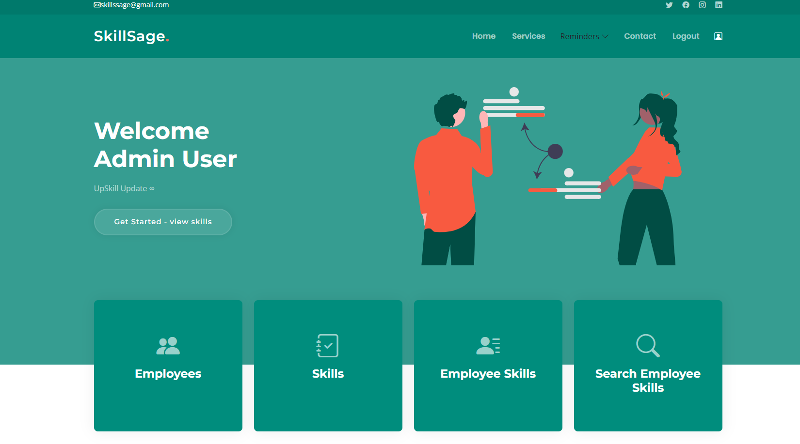
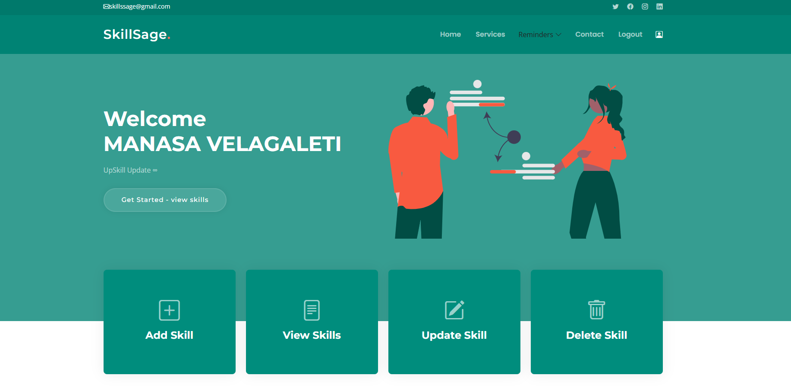
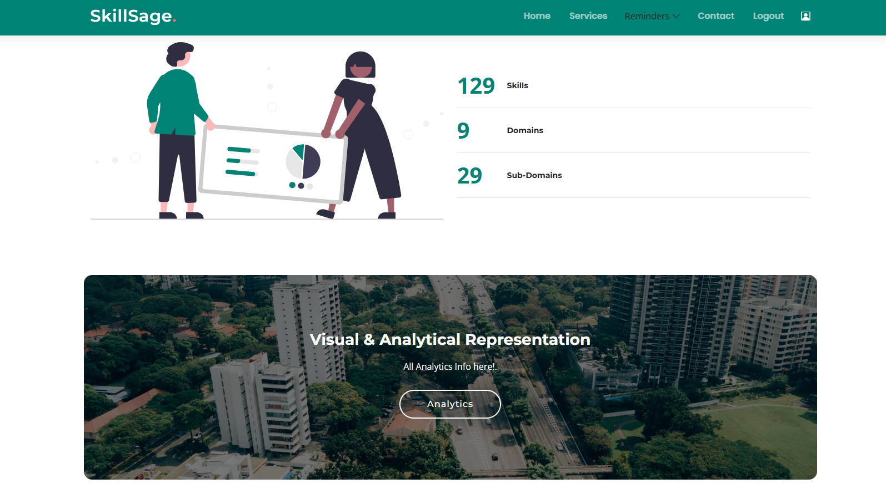
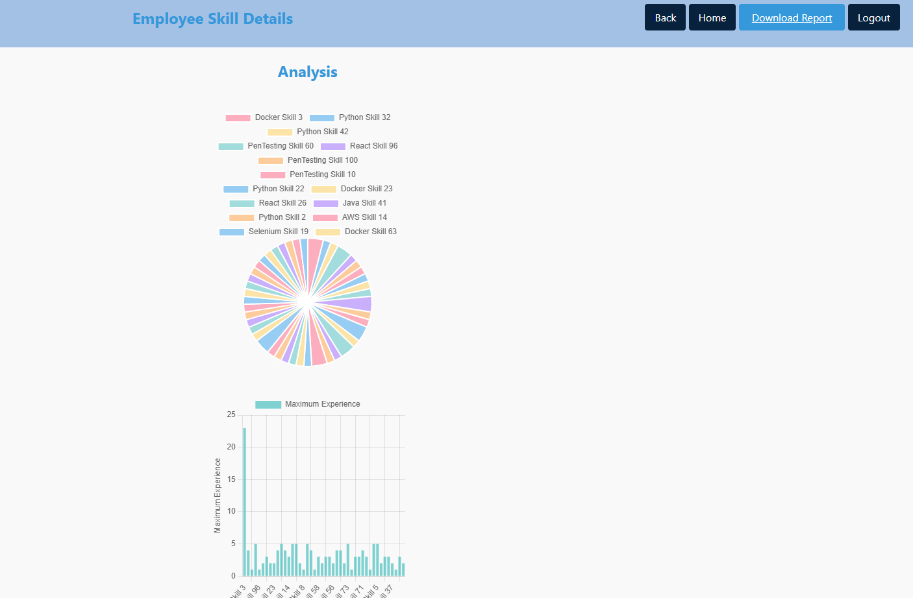
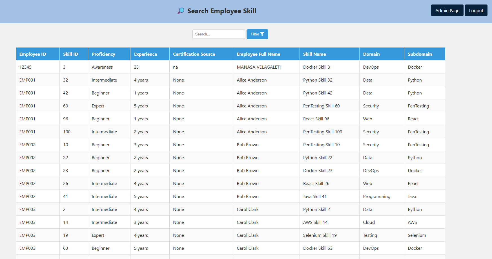
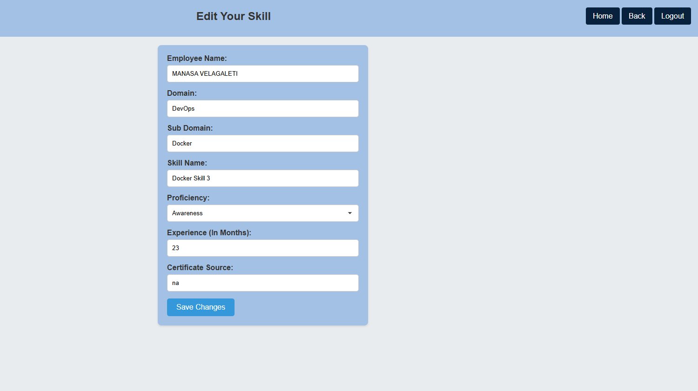
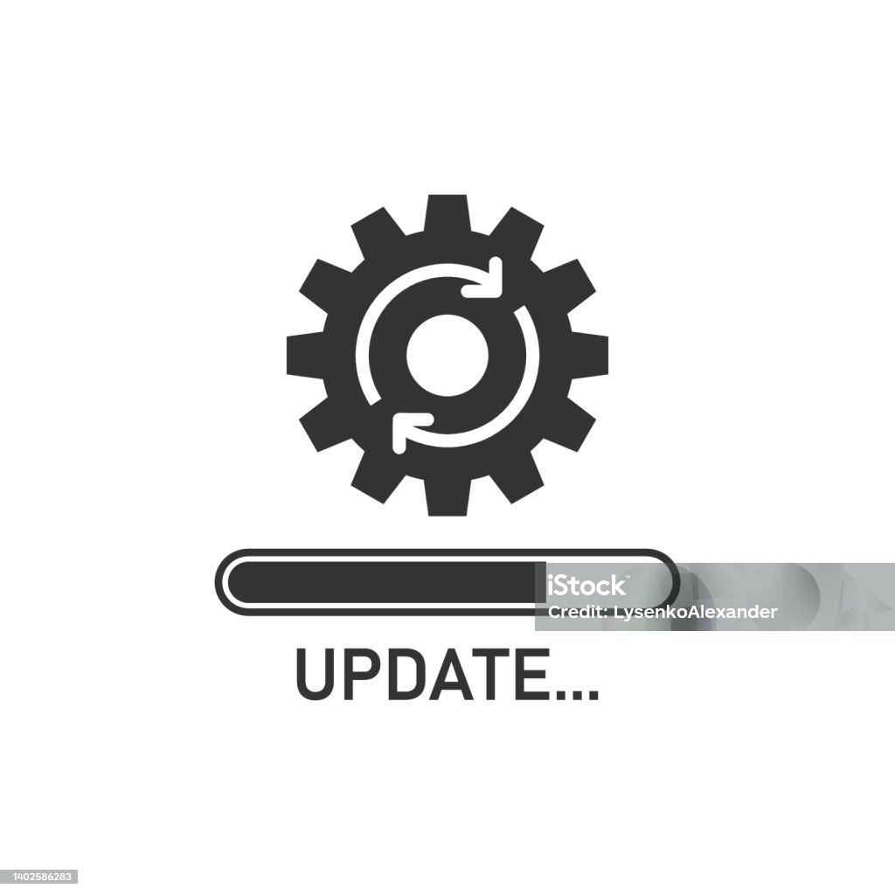

# SkillSage

SkillSage is an employee skill management web application built with Spring Boot. It helps HR and engineering teams capture employee skills, proficiency, certifications and generate organization-level skill analysis to guide hiring and training.

## Key features
- Secure employee registration and authentication (Spring Security + BCrypt)
- Role-based UI: Admin and Employee views
- Manage skills and employee-skill associations (proficiency, experience, certification source)
- Search, filter and bulk operations for skills and employees
- Skill analysis reports (domain coverage, proficiency distribution) for data-driven decisions
- Email/OTP flows for onboarding and password reset

## Additional analysis feature
SkillSage includes visual analysis that aggregates skill coverage by domain and proficiency. Reports include:
- Domain heatmap (how many employees per domain)
- Proficiency distribution (Beginner / Intermediate / Expert)
- Exportable summary reports (CSV)

(Screenshot: images/Skill Analysis.png)

## Architecture overview
Layered Spring Boot architecture:
- Presentation: Thymeleaf templates in `src/main/resources/templates` and static assets in `src/main/resources/static/images`.
- Web layer: Controllers under `com.example.controller` and `com.example.logincontroller` handle routing and views.
- Service layer: Business logic under `com.example.service` and `com.example.logservice`.
- Persistence: Spring Data JPA repositories (`com.example.logrepo`) with Hibernate + MySQL.
- Security: `CustomUserDetailsService` integrates DB-backed users into Spring Security with BCrypt.

Sequence at runtime:
1. Spring Boot starts and initializes beans
2. JPA/Hibernate bootstraps and updates schema (if configured)
3. Web server (embedded Tomcat) serves UI on configured port

## Tech stack
- Java 17, Spring Boot 3.2
- Spring Data JPA, Spring Security, Thymeleaf
- MySQL
- Maven (wrapper included)

## Prerequisites
- JDK 17
- Maven (or use `./mvnw`)
- MySQL (or Docker)
- Port 8001 available

## Configuration
Update `src/main/resources/application.properties` for DB and mail settings. Example:
```
spring.datasource.url=jdbc:mysql://localhost:3306/skillsage
spring.datasource.username=root
spring.datasource.password=<your-db-password>
server.port=8001
```

## Running locally
1. Create database: `CREATE DATABASE skillsage;`
2. Build: `./mvnw -DskipTests package`
3. Run: `java -jar target/your-application.jar`
4. Open `http://localhost:8001`

Or use Docker Compose: `docker-compose up --build` (mysql + app)

## Database (high level)
- `login_details` — users (empid PK, email unique, password hashed, role, fullname)
- `skills` — skills catalog (skillid PK, domain, skillname, subdomain)
- `employee_skill` — mapping of employee ↔ skill with proficiency, experience, certificate source

## Screenshots and assets

The repository includes both root-level screenshots (for the README) and static assets served by the application. The images below are embedded so they render directly in GitHub.

### Root screenshots













---

### In-app static assets (served from `src/main/resources/static/images/`)





These assets appear in the Thymeleaf templates under `src/main/resources/templates/`. Replace any image by updating the corresponding file in `static/images` or the `images/` folder for README screenshots.


## How to create an admin user
For security, no credentials are stored in README. Create an admin user via SQL or the in-app admin UI:
- SQL example:
```
INSERT INTO login_details (empid, email, password, role, fullname)
VALUES ('ADMIN01', 'admin@example.com', '<bcrypt-hash>', 'ADMIN', 'Admin User');
```
Use a BCrypt-hashed password when inserting directly.

## Security notes
- Do not commit secrets to the repository.
- Use environment variables or a secrets manager for DB credentials and mail passwords.
- Rotate any temporary credentials created during testing.

## Contribution
Contributions welcome. Suggested improvements:
- Add OpenAPI / Swagger docs for REST endpoints
- Add automated tests and CI (GitHub Actions)
- Provide sample data seeder and export features

## License
Add a LICENSE file (MIT recommended) if open-sourcing.

---

This README was updated to remove sensitive credentials and provide a clear project overview, architecture and image explanations. Commit and push ready. If you'd like, I can also:
- Rename images (remove spaces) and update links
- Generate a short ER diagram and API reference
